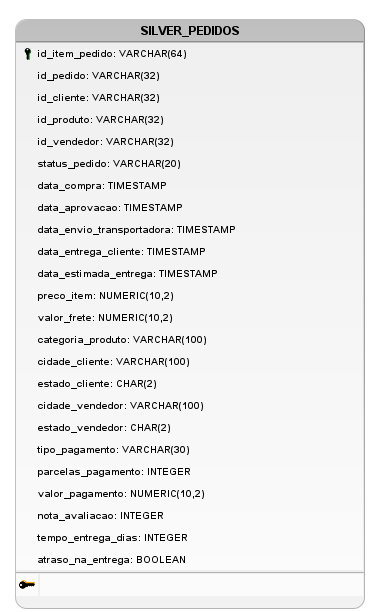

# Documentação da Tabela Consolidada - Camada Silver

Este documento detalha a estrutura final e o conceito por trás da tabela consolidada `pedidos`, que representa a camada Prata (Silver) do nosso Lakehouse. Esta tabela é o principal artefato gerado pelo processo de ETL sobre os dados brutos da camada Bronze.

## 1. O Conceito: A "Tabelona" Única

A tabela `pedidos` foi projetada como uma **tabela fato denormalizada**. Seu objetivo é servir como uma **fonte única da verdade (Single Source of Truth)** para todas as análises relacionadas aos itens de pedidos.

Ao unificar informações de clientes, produtos, vendedores e pagamentos em uma única tabela, ela simplifica drasticamente as consultas analíticas, eliminando a necessidade de múltiplos `JOINs` complexos para os usuários finais (analistas de dados e ferramentas de BI).

## 2. Granularidade: O que Cada Linha Representa?

A granularidade é o nível de detalhe de cada registro. Entender isso é fundamental.

> **Cada linha na tabela `pedidos` representa UM ÚNICO ITEM DENTRO DE UM ÚNICO PEDIDO.**

**Exemplo prático:** Se um pedido com `order_id = 'ABC-123'` contém dois produtos diferentes (um livro e um fone de ouvido), a tabela `pedidos` terá **duas linhas** para esse pedido. Ambas as linhas compartilharão os mesmos dados do pedido (como `id_pedido`, `id_cliente`, `data_compra`), mas terão dados de item diferentes (como `id_produto`, `preco_item`, `valor_frete`).

## 3. Diagrama Lógico de Dados

| Nome da Coluna (Prata) | Tipo (PostgreSQL) | Descrição / Regra de Negócio | Origem (Bronze) |
| :--- | :--- | :--- | :--- |
| `id_item_pedido` | `VARCHAR(64)` | Chave primária sintética (concatenação de order_id e order_item_id). | `olist_order_items.order_id` + `order_item_id` |
| `id_pedido` | `VARCHAR(32)` | ID único do pedido. | `olist_orders.order_id` |
| `id_cliente` | `VARCHAR(32)` | ID único do cliente. | `olist_customers.customer_unique_id` |
| `id_produto` | `VARCHAR(32)` | ID único do produto. | `olist_products.product_id` |
| `id_vendedor` | `VARCHAR(32)` | ID único do vendedor. | `olist_sellers.seller_id` |
| `status_pedido` | `VARCHAR(20)` | Status do pedido. | `olist_orders.order_status` |
| `data_compra` | `TIMESTAMP` | Data e hora em que a compra foi realizada. | `olist_orders.order_purchase_timestamp` |
| `data_aprovacao` | `TIMESTAMP` | Data e hora da aprovação do pagamento. | `olist_orders.order_approved_at` |
| `data_envio_transportadora`| `TIMESTAMP` | Data em que o pedido foi postado na transportadora. | `olist_orders.order_delivered_carrier_date` |
| `data_entrega_cliente` | `TIMESTAMP` | Data da entrega real do pedido ao cliente. | `olist_orders.order_delivered_customer_date`|
| `data_estimada_entrega` | `TIMESTAMP` | Data estimada de entrega informada ao cliente. | `olist_orders.order_estimated_delivery_date`|
| `preco_item` | `NUMERIC(10, 2)` | Preço do item (valor unitário). | `olist_order_items.price` |
| `valor_frete` | `NUMERIC(10, 2)` | Valor do frete do item. | `olist_order_items.freight_value` |
| `categoria_produto` | `VARCHAR(100)`| Nome da categoria do produto em inglês. | `product_category_name_translation` |
| `cidade_cliente` | `VARCHAR(100)`| Cidade do cliente. | `olist_customers.customer_city` |
| `estado_cliente` | `VARCHAR(2)` | UF do estado do cliente. | `olist_customers.customer_state` |
| `cidade_vendedor` | `VARCHAR(100)`| Cidade do vendedor. | `olist_sellers.seller_city` |
| `estado_vendedor` | `VARCHAR(2)` | UF do estado do vendedor. | `olist_sellers.seller_state` |
| `tipo_pagamento` | `VARCHAR(30)` | Método de pagamento principal do pedido. | `olist_order_payments.payment_type` |
| `parcelas_pagamento` | `INTEGER` | Número de parcelas no cartão. | `olist_order_payments.payment_installments` |
| `valor_pagamento` | `NUMERIC(10, 2)` | Valor total pago pelo pedido. | `olist_order_payments.payment_value` |
| `nota_avaliacao` | `INTEGER` | Nota da avaliação do pedido (1 a 5). | `olist_order_reviews.review_score` (após limpeza) |
| `tempo_entrega_dias` | `INTEGER` | Tempo decorrido (em dias) entre a compra e a entrega. | (Cálculo) `data_entrega_cliente` - `data_compra`|
| `atraso_na_entrega` | `BOOLEAN` | Flag que indica se a entrega atrasou (`true`/`false`). | (Cálculo) `data_entrega_cliente` > `data_estimada_entrega`|